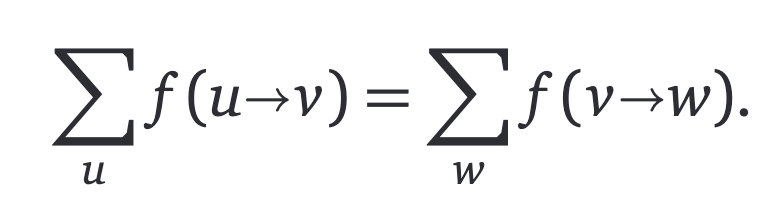
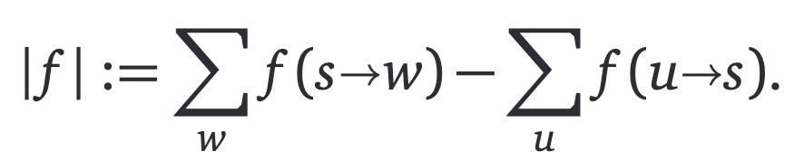
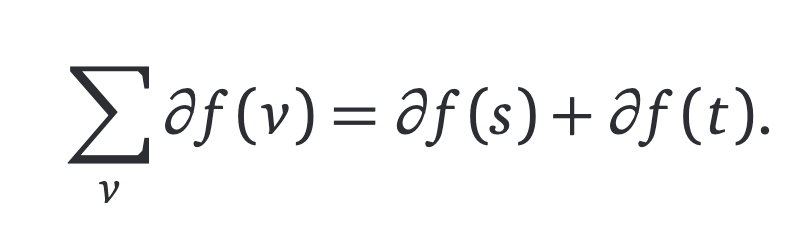
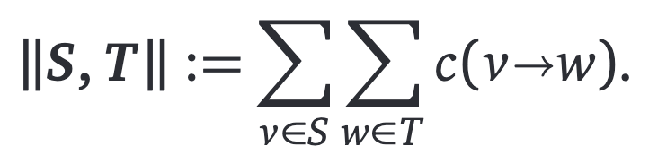

# Flows

An **(s, t)-flow** (or just a **flow** if the source and target vertices are clear from context) is a function f: E -> R that satisfies the following **conservation constraint** at every vertex v except possibly s and t:

In English, the total flow into v is equal to the total flow out of v. To keep the notation simple, we define f(u -> v) = 0 if there is no edge u -> v in the graph.

The **value** of the flow f, denoted **|f|**, is the total net flow out of the source vertex s:

It's not hard to prove that |f| is also equal to the total net flow into the target vertex t, as follows. To simplify notation, let **&delta;f(v)** denote the total net flow out of any vertex v:

&delta;f(v) = &Sigma;f(u -> v) - &Sigma;f(v -> w)

The conservation constraint implies that &delta;f(v) = 0 on every vertex v except s and t, so

On the other hadn't, any flow that leaves on vertex must enter another vertex, so we must have &Sigma;&delta;f(v) = 0. It follows immediately that |f| = &delta;f(s) = -&delta;f(t).

Now suppose we have another function c: E -> R that assigns a non-negative **capacity** c(e) to each edge e. We say that a flow f is **feasible** (with respect to c) if 0 &le; f(e) &le; c(e) fir every edge e. Most of the time we consider only flows that are feasible with respect to some fixed capacity function c. We say that a flow f **saturates** edge e if f(e) = c(e), and **avoids** edge e if f(e) = 0. The **maximum flow problem** is to compute a feasible (s, t)-flow in a given directed graph, with a given capacity function, whose value is as large as possible.

# Cuts

An (s, t)-cut (or just a cut if the source and target vertices are clear from context) is a partition of the vertices into disjoint subsets S and T -- meaning S &cup; T = V and S &cap; T = &empty; -- where s &in; S and t &in; T.

If we have a capacity function c: E -> R, the **capacity** of a cut is the sum of the capacities of the edges that start in S and end in T:

如果 v -> w 不存在与图中的话，那么我们假设 c(v -> w) = 0。Notice that the definition is asymmetric; edges that start in T and end in S are unimportant. 

The **minimum cut problem** is to compute an (s, t)-cut whose capacity is as small as possible.

Intuitively, the minimum cut is the cheapest way to disrupt all flow from s to t. 

If |f| = ||S, T||, then f must be a maximum flow, and (S, T) must be a minimum cut.

# The Maxflow-Mincut Theorem

**The Maxflow-Mincut Theorem.** In every flow network with source s and target t, the value of the maximum (s, t)-flow is equal to the capacity of the minimum (s, t)-cut.

# Algorithms for Maxflow-Mincut

存在着非常多计算 maxflow-mincut 的算法，但是我们只需要记住最快的 maxflow-mincut 算法的时间复杂度是 O(VE) 即可。

**记住：Maximum flows can be computed in O(VE) time.**

