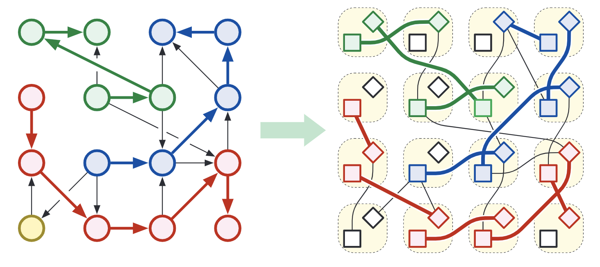

# Edge-Disjoint Paths

One of the easiest applications of maximum flows is computing the maximum number of edge-disjoint paths between two specified vertices s and t in a directed graph G using maximum flows. A set of paths in G is edge-disjoint if each edge in G appears in at most one of the paths; several edge-disjoint paths may pass through the same vertex, however. 

# Vertex Capabilities and Vertex-Disjoint Paths

Now suppose the vertices of the input graph G have capacities, not just the edges. In addition to our other constraints, for each vertex v other than s and t, we require the total flow into v (and therefore the total flow out of v) to be at most some non-negative value c(v):

Can we still compute maximum flows with these new vertex constraints?

Yes! Replace every vertex v with two vertices vin and vout, connect by an edge vin -> vout with capacities c(v), and then replace every directed edge u -> v with the edge uout -> vin (keeping the same capacity). 

It is now easy to compute the maximum number of vertex-disjoint paths from s to t in O(VE) time: Assign capacity 1 to every vertex and compute a maximum flow!

# Bipartite Matching

Another natural application of maximum flows is finding maximum **matchings** in bipartite graphs. A matching is a subgraph in which every vertex has degree at most one, or equivalently, a collection of edges such that no two share a vertex. The problem is to find a matching with the maximum number of edges. 

For example, suppose we have a set of doctors who are looking for jobs, and a set of hospitals who are looking for doctors. Each doctor lists all hospitals where they are willing to work, and each hospital lists all doctors they are willing to hire. Our task is to find the largest subset of doctor-hospital hires that everyone is willing to accept. This problem is equivalent to finding a maximum matching in a bipartite graph whose vertices are the doctors and hospitals, and there is an edge between a doctor and a hospital if and only if each find the other acceptable. 

**Solution:**

We can solve this problem by reducing it to a maximum flow problem, as follows. Let G be the given bipartite graph with vertex as L &cup; R, such that every edge joins a vertex in L to a vertex in R. We create a new directed graph G' by

1. Orienting each edge from L to R.
2. Adding a new source vertex s with edges to every vertex in L.
3. Adding a new target vertex t with edges from every vertex in R. 
4. Finally, we assign every edge in G' a capacity of 1.

Any matching M in G can be transformed into a flow fM in G' as follows: For each edge uw in M, push one unit of flow along the path s -> u -> w -> t. These paths are disjoint except at s and t, so the resulting flow satisfies the capacity constraints. Moreover, the value of the resulting flow is equal to the number of edges in M. 

And the size of the maximum matching in G is equal to the value of the maximum flow in G'. 

# Tuple Selection

The bipartite maximum matching problem is the simplest example of a broader class of problems that I call **tuple selection.** The input to a tuple selection problem consists of several finite sets X1, X2, ..., Xd, each representing a different discrete resource. Our task is to select the largest possible set of d-tuples, each containing exactly one element form each set Xi, subject to several *capacity* constraints of the following form:

- For each index i, each element x &in; Xi can appear in at most c(x) selected tuples.
- For each index i, any two elements x &in; Xi and y &in; Xi+1 can appear in at most c(x, y) selected tuples.

Each of the upper bounds c(x) and c(x, y) is either (typically small) non-negative integer or &infin;.

Using Orlin's algorithm, we can compute the maximum flow in **O(VE) time**.

## Exam Scheduling

The following "real world" scheduling problem might help clarify our general reduction.

University has hired you to write an algorithm to schedule their final exams. There are n different classes, each of which needs to schedule a final exam in one of r rooms during one of t different time slots. At most one class's final exam can be scheduled in each room during each time slot; conversely, classes cannot be split into multiple rooms or multiple times. Moreover, each exam must be overseen by one of p proctors. Each proctor can oversee at most one exam at a time; each proctor is available for only certain time slots; and no projector is allowed oversee more than 5 exams total. The input to he scheduling problem consists of three arrays:

- An integer array E[1..n] where E[I] is the number of students enrolled in the ith class.
- An integer array S[1..r], where S[j] is the number of seats in the jth room. The ith class's final exam can be held in the jth room if and only if E[I] &le; S[j].
- A boolean array A[1..t, 1..p] where A[k, l] = True if and only if the lth proctor is available during the kth time slot.

Let N = n + r + tp denote the total size of the input. Your job is to design an algorithm that either schedules a room, a time slot, and a proctor for every class's final exam, or correctly reports that no such schedule is possible. 

This is a standard tuple-selection problem with four resources: classes, rooms, time slots, and proctors. To solve this problem, we construct a flow network G with six types of vertices -- a source vertex s', a vertex ci for each class, a vertex rj for each room, a vertex tk for each time slot, a vertex plfor each proctor, and a target vertex t' -- and five types of edges, as shown below:

- An edge s' -> ci with capacity 1 for each class i. ("Each class can hold at most one final exam.")
- An edge ci -> rj with capacity &infin; for each class i and room j such that E[I] &le; S[j]. ("Class i can hold exams in room j if and only if the room has enough seats. ") This is the only place where the enrollments E[i] and seat numbers S[j] are used.
- An edge rj -> tk with capacity 1 for each room j and time slot k. ("At most one exam can be held in room j at time k.")
- An edge tk -> pl with capacity 1 for time slot k and proctor l such that A[l, k] = True. ("A proctor can oversee at most one exam at any time, and only during times that they are available. ")
- An edge pl -> t' with capacity 5 for each proctor l. ("Each proctor can oversee at most 5 exams.")

Each path from s' to t' in G represents a unique valid choice of calls, room, time, and proctor for one final exam; specifically, the class fits into the room, and the proctor is available at that time. Conversely, for each valid choice (class, room, time, proctor), there is a corresponding path from s' to t' in G. Thus, we can construct a valid schedule for the maximum possible number of exams by computing an maximum (s', t')-flow f* in G, decomposing f* into paths from s' to t', and the transcribing each path into a class-room-time-proctor assignment. If |f*| = n, we can return the resulting schedule; otherwise, we can correctly report that scheduling all n final exams is impossible.

Constructing G from the given input data by brute force takes O(E) time. We can compute the maximum flow in O(VE) time using Orlin's algorithm, and we can compute the flow decomposition in O(VE) time. Thus, the overall algorithm runs in O(VE) = **O(N3 ) time**.

# Disjoint-Path Covers

A **path cover** of a directed graph G is a collection of directed paths in G such that every vertex of G lies on at least one path. A **disjoint**-path cover of G is a path cover such that every vertex of G lies on *exactly* one path. Every directed graph has a trivial disjoin-path cover consisting of several paths of length zero, but that's boring. Instead, let's look for disjoin-path covers that contain as few paths as possible. This problem is NP-hard in general. But there is an efficient flow-based algorithm for directed *acyclic* graphs.

To solve this problem for a given direct acyclic graph G = (V, E), we construct a new bipartite graph G' = (V', E') as follows.

-  G' contains two vertices ub and v# for every vertex v of G.
- G' contains an undirected edge ubv# for every directed edge u -> v in G.

G can be covered by k disjoint paths if and only if the new graph G' has a matching of size V - k. 

## Minimal Faculty Hiring

University offers several thousand courses every day. Due to extreme budget cuts, the university needs to significantly reduce the size of its faculty. However, because students pay tuition, the university must retain enough professors to guarantee that every class advertised in the course catalog is actually taught. How few professors can university get away with? Each remaining faculty member will be assigned a sequence of classes to teach on any given day. The classes assigned to each professor must not overlap; moreover, there must be enough slack in each professor's schedule for them to walk from one class to the next. 

Concretely, suppose there are n classes offered in m different locations. The input to our problem consists of the following data:

- An array C[1..n] of classes, where each class C[i] has three fields: the starting time C[i].start, the ending time C[i].end and the location C[i].loc.
- A two-dimensional array T[1..m, 1..m] where T[u, v] is the time required to walk from location u to location v. 

We want to find the minimum number of professors that can collectively teach every class, such that whenever a professor is assigned to teach two classes i and j where C[j].start &ge; C[i].start, we actually have

C[j].start &ge; C[i].end + T[C[i].loc, C[j].loc]

We can solve this problem by reducing it to a disjoint-path cover problem as follows. We construct a dag G = (V, E) whose vertices are classes and whose edges represent pairs of classes that are scheduled far enough apart to be taught by the same professor. Specifically, a directed edge i -> j indicates that the same professor can teach class i and then class j. It is easy to construct this dag in O(n2) time by brute force. Then we find a disjoin-path cover of G using the matching algorithm described above; each directed path in G represents a legal class schedule for one professor. The entire algorithm runs in O(n2 + VE) = **O(n3) time**.

# Baseball Elimination

TBD.

# Project Selection

TBD.

 

