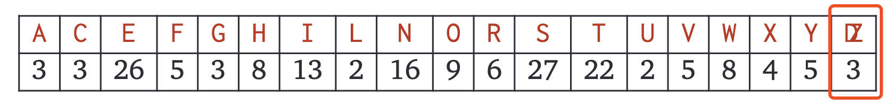

# General Pattern

我们通常采用 `inductive exchange argument` 的方式来证明贪婪算法。

- Assume that there is an optimal solution that is different from the greedy solution.
- Find the "first" difference between the two solutions.
- Argue that we can exchange the optimal choices for the greedy choices without making the solution worse (although the exchange might not make it better).

This argument implies by induction that some optimal solution *contains* the entire greedy solution, and therefore equals the greedy solution. Sometimes, an additional step is required to show no optimal solution *strictly* improves the greedy solution.

# Huffman Codes

A *binary code* assigns a string of 0s and 1s to each character in the alphabet. A binary code is *prefix-free* if no code is a prefix of any other. 

Any prefix-free binary code can be visualized as a binary tree with the encoded characters stored at the leaves. The code word for any symbol is given by the path from the root to the corresponding leaf; **0** for left, **1** for tight. Thus, the length of any symbol's codeword is the depth of the corresponding leaf in the code tree. 
Although binary code tress and binary search trees are very similar, they are not the same thing. We don't care at all about the order of symbols at the leaves.

**Huffman: Merge the two least frequent letters (breaking ties arbitrarily) and recurse.**

Example:

Given the following text:

We have the following frequencies:

Merge the two least frequent letters (breaking ties arbitrarily), in this example, we merge Z and D. 

Thus we have the following new frequency table (note the new letter at the end of the table): 

And keep recursing, we would generate the following binary code tree: 

