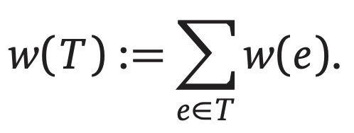

# Introduction

首先，我们需要明确的是最小生成树算法是针对 connected, undirected weighted graph 的。这一篇笔记讲了几个计算最小生成树的算法，即最小化下面这个公式的值的算法：



# Distinct Edge Weights

首先有一个定理：

**If all edge weights in a connected graph G are distinct, then G has a unique minimum spanning tree.**

所以我们需要一个 break tie 的算法：

```
ShorterEdge(i, j, k, l):
  if w(i, j) < w(k, l) then return (i, j)
  if w(i, j) > w(k, l) then return (k, l)
  if min(i, j) < min(k, l) then return (i, j)
  if min(i, j) > min(k, l) then return (k, l)
  if max(i, j) < max(k, l) then return (i, j)
  else return (k, l)
```

# 唯一的最小生成树算法

存在着很多计算最小生成树的算法，但是几乎所有算法都是下面的 general strategy 的变形。

通用的最小生成树算法维持了一个输入图 G 的子图 F，我们将该子图称为 _intermediate spanning forest_. 在任何时刻，F 都满足了下面的不变量:

**F 是 G 的最小生成树的子图。**

存在着三种边：

1. useless：如果一条边不存在于 F，但是它的两个节点都在 F 中的同一个组件中。
2. safe：An edge is safe if it is the minimum-weight edge with exactly one endpoit in some component of F.
3. undecided：所有不属于上面两种边的其他边。

然后有着下面两个定理：

1. G 的最小生成树包含了所有的安全边。
2. 最小生成树不包含任何无用边。

# Boruvka's Algorithm

`Boruvka: Add all the safe edges and recurse.`

Boruvka 算法的复杂度是 **O(E \* logV)**.

```
Boruvka(V, E):
  F <- (V, ∅)
  count <- CountAndLabel(F)
  while count > 1
    AddAllSafeEdges(E, F, count)
    count <- CountAndLabel(F)
  return F

CountAndLabel(G):
  count <- 0
  for all vertices v
    unmark v
  for all vertices v
    if v is unmarked
      count <- count + 1
      LabelOne(v, count)
  return count

LabelOne(v, count):
  put v into the bag
  while the bag is not empty
    take v from the bag
    if v is unmarked
      mark v
      comp(v) <- count
      for each edge vw
        put w into the bag

AddAllSafeEdges(E, F, count):
  for i <- 1 to count
    safe[i] <- null
  for each edge uv ∈ E
    if comp(u) != comp(v)
      if safe[comp(u)] = null or w(uv) < w(safe[comp(u)])
        safe[comp(u)] <- uv
      if safe[comp(v)] = null or w(uv) < w(safe[comp[v]])
        safe[comp(v)] <- uv
  for i <- 1 to count
    add safe[i] to F
```

# Prim's Algorithm

`Prim: Repeatedly add T's safe edges to T.`

Prim 算法的复杂度是 **O(E \* logV)**.

To implement Prim's algorithm, we keep all the edges adjacent to T in a priority queue. When we pull the minimum-weight edge out of the priority queue, we first check whether both of its endpoints are in T. If not, we add the edge to T and then add the new neighboring edges to the priority queue. In other words, Prim's algorithm is a variant of "best-first search". If we implement the underlying priority queue using a standard binary heap, Prim's algorithm runs in O(E·logE) = **O(E·logV)** time.

# Kruskal's Algorithm

`Kruskal: Scan all edges by increasing weight; if an edge is safe, add it to F.`

Kruskal 算法的复杂度是 **O(E \* logV)**.

```
Kruskal(V, E):
  sort E by increasing weight
  F <- (V, ∅)
  for each vertex v ∈ V
    MakeSet(v)
  for i <- 1 to |E|
    uv <- ith lightest edge in E
    if Find(u) != Find(v)
      Union(u, v)
      add uv to F
  return F
```
