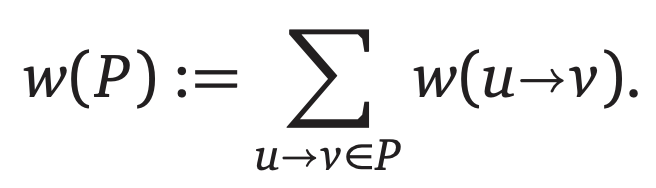

# Introduction

最短路径问题即给定一张图以及两个特殊的节点，找到一条从起始点 s 出发到达目的点 t 的最短路径。即，我们希望找到一条从 s 到 t 的路径 P，并且该路径最小化下面的函数：



# 最短路径树

几乎所有已知的最短路径算法其实都计算了一个更加 general 的问题，即 Single Source Shortest Path，也就是 SSSP 问题：找到从节点 s 出发到图中其他所有点的最短路径。这个问题通常通过找到一个根位于 s 的最短路径树来解决。

# The Only SSSP Algorithm

和 graph traversal 和最小生成树一样，很多 SSSP 算法都可以看作是一个 general algorithm 的特殊情况。

该 general strategy 如下。

每个节点存储两个值：

- _dist(v)_ 是从 s -> v 的一条不确定的最短路径的长度，如果该条路径不存在，则该值为 ∞。
- _pred(v)_ 是在一条不确定的最短路径中 v 的 predecessor，如果该路径不存在，则该值为 null。

在该算法的开头，我们需要像下面这样初始化各个节点所保存的值：

```
InitSSSP(s):
  dist(s) <- 0
  pred(s) <- null
  for all vertices v != s
    dist(v) <- ∞
    pred(v) <- null
```

而在算法执行过程中，存在着所谓的 tense edges。

- _tense edge_ - an edge u -> v is **tense** if dist(u) + w(uv) < dist(v).

而对于这些 tense edges，我们就需要 relax 这些 edges：

```
Relax(u -> v):
  dist(v) <- dist(u) + w(u -> v)
  pred(v) <- u
```

现在所有必需品已经完备，我们来看该算法。Ford's generic algorithm 可以使用一句话来描述：

> Repeatedly relax tense edges, until there are no more tense edges.

```
FordSSSP(s):
  InitSSSP(s)
  while there is at least one tense edge
    Relax any tense edge
```

那么如何找到 tense edges 以及在存在多条 tense edges 的情况下选择一条 tense edge 呢？对于不同类型的输入图我们使用不同的策略。

# Unweighted Graph: Breath-First Search

时间复杂度为 **O(V + E)**。

```
BFS(s):
  InitSSSP(s)
  Push(s)
  while the queue is not empty
    u <- Pull()
    for each edge u -> v
      if dist(v) > dist(u) + w(u -> v)
        dist(v) <- dist(u) + w(u -> v)
        pred(v) <- u
        Push(v)
```

# DAG: Depth-First Search

该算法的核心就是利用了 DAG 存在着 topological ordering 这一点。由于存在着拓扑排序这一特点，我们可以将其看作是以下的递归关系：

dist(v) =

1. 0, if v = s
2. the minimum of (dist(u) + w(u -> v)), otherwise

该算法的时间复杂度为 **O(V + E)**。

```
DAGSSSP(s):
  for all vertices v in topological order
    if v = s
      dist(v) <- 0
    else
      dist(v) <- ∞
      for all edges u -> v
        if dist(v) > dist(u) + w(u -> v)
          dist(v) <- dist(u) + w(u -> v)
          pred(v) <- u

// 上面的算法和下面的算法一模一样
DAGSSSP(s):
  InitSSSP(s)
  for all vertices v in topological order
    for all edges u -> v
      if u -> v is tense
        Relax(u -> v)

// 然而上面的算法使用的是从 u 到 v 的边，我们可以将它改下为下面这样
PushDAGSSSP(s):
  InitSSSP(s)
  for all vertices u in topological order
    for all outgoing edges u -> v
      if u -> v is tense
        Relax(u -> v)
```

# Best-First: Dijkstra's Algorithm

如果我们将第一种情况中的队列换成一个优先队列并使用 dist(v) 作为 priority 值，我们就得到了另一个算法，Dijkstra's Algorithm。

Dijkstra 只有在图不包含 negative cycles 的情况下才能成功，否则会无限循环。

如果图不包含 negative edges 的话，该算法的时间复杂度为 **O(E \* log V)** （如果我们使用 binary-heap 来实现 priority queue 的话）。

```
Dijkstra(s):
  InitSSSP(s)
  Insert(s, 0)
  while the priority queue is not empty
    u <- ExtractMin()
    for all edges u -> v
      if u -> v is tense
        Relax(u -> v)
        if v is in the priority queue
          DecreaseKey(v, dist(v))
        else
          Insert(v, dist(v))
```

如果给定的图不包含负权重的边的话，我们可以简化 Dijkstra 算法：

```
NonNegativeDijkstra(s):
  InitSSSP(s)
  for all vertices v
    Insert(v, dist(v))
  while the priority queue is not empty
    u <- ExtractMin()
    for all edges u -> v
      if u -> v is tense
        Relax(u -> v)
        DecreaseKey(v, dist(v))
```

上面的算法即 "best-first search" 。

当图包含 negative edges 时，the worst-case running time of Dijkstra 实际上是 exponential 的 （2<sup>V</sup>）。 然而，在实践中，即使图包含 negative edges，Dijkstra 算法通常也是非常快的。

考虑到在图包含 negative edges 时，Dijkstra 的最坏时间复杂度，当我们计算 APSP 问题时，会 reweight 所有边来清除 negative edges。

# Relax ALL the Edges: Bellman-Ford

_Bellman-Ford: Relax ALL the tense edges, then recurse._

该算法的时间复杂度为 **O(VE)**。

```
BellmanFord(s):
  InitSSSP(s)
  while there is at least one tense edge
    for every edge u -> v
      if u -> v is tense
        Relax(u -> v)
```

具体来说，我们需要使用下面的代码：

```
BellmanFord(s):
  InitSSSP(s)
  repeat V - 1 times
    for every edge u -> v
      if u -> v is tense
        Relax(u -> v)
  for every edge u -> v
    if u -> v is tense
      return "Negative Cycles!"
```
