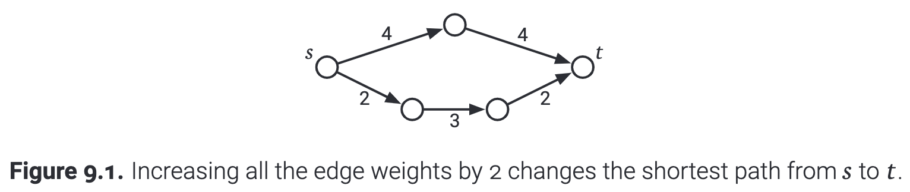

# Intro

在 SSSP 的算法中，我们为图中的每一个节点记录了以下两个信息:

- dist(v) is the length of the shortest path from s to v;
- pred(v) is the second-to-last vertex in the shortest path from s to v

在这篇笔记中，我们学习更普适的 **all pairs shortest path problem （APSP）**, which asks for the shortest path from ever possible source to every possible destination. 在 APSP 算法中，我们为每一对节点 u 和 v 记录了下面的两个信息：

- dist(u, v) is the length of the shortest path from u to v;
- pred(u, v) is the second-to-last vertex on the shortest path from u to v.

这些直观的定义排除了一些 boundary cases。

- 如果 u 和 v 之间不存在 path，那么 u 和 v 之间也就不存在 shortest path；在这种情况下，我们定义 dist(u, v) = &infin; 以及 pred(u, v) = Null。
- 如果 u 和 v 之间存在着一个 negative cycle，then there are paths from u to v with arbitrarily negative length；在这种情况下，我们定义 dist(u, v) = -&infin; 以及 pred(u, v) = Null。
- 最后，if u does not lie on a negative cycle, then the shortest path from u to itself has no edges, and therefore doesn't have a last edge; 在这种情况下，我们定义 dist(u, v) = 0 以及 pred(u, v) = Null。

The desired output of the all-pairs shortest path problem is a pair of V x V arrays, one storing all V<sup>2</sup> shortest-path distances, the other storing all V<sup>2</sup> predecessors. 

# Lots of Single Sources

APSP 问题最直观的解法就是运行 SSSP 算法 V 次，也就是对每一个可能的节点都运行一次 SSSP 算法。

```
ObviousAPSP(V, E, w):
	for every vertex s
		dist[s, ] <- SSSP(V, E, w, s)
```

这个算法的运行时长取决于我们使用哪一种 SSSP 算法。所以存在着四种可能：

- 如果图中边是 unweighted，那么我们可以使用 BFS，overall running time 是 O(VE) = O(V<sup>3</sup>)。
- 如果图是 acyclic 的，那么我们可以以拓扑排序的顺序扫描节点，overall running time 是 O(VE) = O(V<sup>3</sup>)。
- 如果所有边的权重都是非负的话，我们可以使用 Dijkstra’s 算法，overall running time 是 O(VElogV) = O(V<sup>3</sup>logV)。
- 最后，最普适的情况下，使用 Bellman-Ford 算法，overall running time 是 O(V<sup>2</sup>E) = O(V<sup>4</sup>)。

# Reweighting

Negative edges slow us down significantly; can we get rid of them? 当然了！我们可以使用 reweighting 的技术来消除 negative edges。

一个非常简单的想法是给每一条边都加上同样的权重来消除负权重边，这样的话我们就可以使用更快的 Dijkstra's 算法而不是 Bellman-Ford 算法了。

Unfortunately, this simple idea doesn't work, intuitively because our two natural notions of "length" are incompatible -- paths with more edges can have smaller total weight than paths with fewer edges. If we increase all edge weights at the same rate, paths with more edges get longer faster than paths with fewer edges; as a result, the shortest path between two vertices might change. 



However, there is a more subtle method for reweighting edges that does preserve shortest paths. 

Suppose each vertex v has some associated price &pi;(v), which might be positive, negative, or zero. We can define a new weight function w' as follows:

w'(u -> v) = &pi;(u) + w(u -> v) - &pi;(v)

To give some intuition, imagine that when we leave vertex u, we have to pay an exit tax of &pi;(u), and when we enter v, we get &pi;(v) as an entrance gift.

It's not hard to show that shortest paths with the new weight function w' are exactly the same as shortest paths with the original weight function w. In fact, for any path u ~> v from one vertex u to another vertex v, we have

w' (u ~> v) = &pi;(u) + w(u ~> v) - &pi;(v)

We pay &pi;(u) in exit fees, plus the original weight of  the path, minus the &pi;(v) entrance gift. At every intermediate vertex x on the path, we get &pi;(x) as an entrance gift, but then immediately pay it back as an exit tax! Since all paths from u to v change length by exactly the same amount, the shortest path from u to v does not change. (Paths between different Paris of vertices could change lengths by different amounts, so their order could change.)

# Johnson's Algorithm

Johnson's APSP 算法为每一个节点计算了一个 &pi;(v)，以使所有边的权重都为非负数，之后对每一个节点使用 Dijkstra's 来得到针对所有节点的最短路径。

First, suppose the input graph has a vertex s that can reach all the other vertices. Johnson's algorithm computes the shortest paths from s to the other vertices, using Bellman-Ford (which doesn't care if the edge weights are negative), and then reweighs the graph using the price function &pi;(v) = dist(s, v). The new weight of every edge is

w'(u -> v) = dist(s, u) + w(u -> v) - dist(s, v)

注意这些新的权重都是非负的，因为 Bellman-Ford 正确运行并结束了。Recall that an edge u -> v is tense if dist(s, u) + w(u -> v) < dist(s, v), and that SSSP algorithms eliminate all tense edges. (If Bellman-Ford detects a negative cycle, Johnson's algorithm aborts, because shortest paths are not well-defined.)

If there is no suitable vertex s that can reach everything, then no matter where we start Bellman-Ford, some of the resulting vertex prices will be infinite. To avoid this issue, we *always* add a new vertex s to the graph, with zero-weight edges from s to the other vertices, but no edges going back into s. This addition doesn't change the shortest paths between any pair of original vertices, because there are no paths into s.

Johnson's 算法的完整伪代码如下。The running time of this algorithm is dominated by the calls to Dijkstra's algorithm. Specifically, we spend O(VE) time running Bellman-Ford once, O(VElogV) time running Dijkstra V times, and O(V + E) time doing other bookkeeping. Thus, the overall running time is **O(VElogV) = O(V<sup>3</sup>logV)**. Negative edges don't slow use down after all!

```
JohnsonAPSP(V, E, w):
	// Add an artificial source
	add a new vertex s
	for every vertex v
		add a new edge s -> v
		w(s -> v) <- 0
		
	// Compute vertex prices
	dist[s, ] <- BellmanFord(V, E, w, s)
	if BellmanFord found a negative cycle
		fail gracefully
		
	// Reweight the edges
	for every edge u -> v in E
		w'(u -> v) <- dist[s, u] + w(u -> v) - dist[s, v]
	
	// Compute reweighted shortest path distances
	for every vertex u
		dist'[u, ] <- Dijkstra(V, E, w', u)
	
	// Compute original shortest-path distances
	for every vertex u
		for every vertex v
			dist[u, v] <- dist'[u, v] - dist[s, u] + dist[s, v]
```

# Dynamic Programming

TBD.

# Divide and Conquer

TBD.