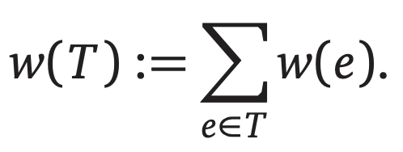

- [Basics](#basics)
  - [Reduction](#reduction)
    - [Simplify and Delegate](#simplify-and-delegate)
    - [The Pattern](#the-pattern)
    - [Recursion Trees](#recursion-trees)
  - [Backtracking](#backtracking)
    - [The General Pattern](#the-general-pattern)
  - [Dynamic Programming](#dynamic-programming)
    - [General Approach To Dynamic Programming](#general-approach-to-dynamic-programming)
  - [Greedy Algorithms](#greedy-algorithms)
- [Graph Theory](#graph-theory)
  - [Graph Traversal](#graph-traversal)
  - [Depth-First Search](#depth-first-search)
    - [Introduction](#introduction)
    - [Preorder and Postorder](#preorder-and-postorder)
    - [Detecting Cycles](#detecting-cycles)
    - [Topological Ordering](#topological-ordering)
    - [Strongly Connected Components](#strongly-connected-components)
  - [Minimum Spanning Tree](#minimum-spanning-tree)
    - [Distinct Edge Weights](#distinct-edge-weights)
    - [唯一的最小生成树算法](#唯一的最小生成树算法)
    - [Boruvka's Algorithm](#boruvkas-algorithm)
    - [Prim's Algorithm](#prims-algorithm)
    - [Kruskal's Algorithm](#kruskals-algorithm)
  - [Single-Source Shortest Path](#single-source-shortest-path)
    - [Introduction](#introduction-1)
    - [最短路径树](#最短路径树)
    - [The Only SSSP Algorithm](#the-only-sssp-algorithm)
    - [Unweighted Graph: BFS](#unweighted-graph-bfs)
    - [DAG: DFS](#dag-dfs)
    - [Best-First: Dijkstra's Algorithm](#best-first-dijkstras-algorithm)
    - [Relax All the Edges: Bellman-Ford](#relax-all-the-edges-bellman-ford)
  - [All-Pairs Shortest Path](#all-pairs-shortest-path)
  - [Maximum Flows & Minimum Cuts](#maximum-flows--minimum-cuts)
  - [Applications of Flows and Cuts](#applications-of-flows-and-cuts)

# Basics

## Reduction

我们在算法设计的过程中最常用的技术就是`reduction`。

将问题 X 归纳为问题 Y 意味着我们为问题 X 设计的算法中以黑盒的形式使用了用来解决问题 Y 的算法来解决问题 X。而这个黑盒内部是如何工作的并不在我们的关心范围内。一般来说，我们最好将黑盒看作是一个呢能够通过魔法来正确解决问题 Y 的工具，不要试图理解它内部是如何工作的。

### Simplify and Delegate

`递归`是一种非常强的的 reduction，我们可以通过下面两个部分来简单的定义递归：

- If the given instance of the problem can be solved directly, solve it directly.
- Otherwise, reduce it to one or more **simpler instances of the same problem**.

我们可以想象有人会替我们完成那些 simpler cases。我们可以将这个帮我们解决 simpler instances 的人称为 **Recursion Fairy**，当然，这个递归精灵的学名是 **Induction Hypothesis**。

而所有递归算法都需要满足一个条件：There must be no infinite sequence of reductions to simpler and simpler instances.

递归算法的必须有一个可以通过其他方法求解的最基础的 **base case**，否则的话，递归算法就是无限循环。

### The Pattern

很多递归算法（例如 merge sort 和 quick sort 都遵守了一个 general three-step pattern called `divide and conquer`。

1. **Divide** the given instance of the problem into several _independent smaller_ instances of _exactly_ the same problem.
1. **Delegate** each smaller instance to the Recursion Fairy.
1. **Combine** the solutions for the smaller instances into the final solution for the given instance.

If the size of any instance falls below some constant threshold, we abandon recursion and solve the problem directly, by brute force, in constant time.

### Recursion Trees


There are three common cases where the level-by-level series (Σ) is especially easy to evaluate:

- **Decreasing**: If the series _decays exponentially_ -- every term is a constant factor smaller than the previous term -- then T(n) = O(f(n)). In this case, the sum is dominated by the value at the root of the recursion tree.
- **Equal**: If all terms in the series are _equal_, we immediately have T(n) = O(f(n)·L) = O(f(n)·log<sub>c</sub>n).
- **Increasing**: If the series _grows exponentially_ -- every term is a constant factor larger than the previous term -- then T(n) = O(r<sup>log<sub>c</sub>n</sup>) = O(n<sup>log<sub>c</sub>r</sup>). In this case, the sum is dominated by the number of leaves in the recursion tree.

## Backtracking

另外一个重要的递归策略是`backtracking`（回溯）。

A backtracking algorithm tries to construct a solution to a computational problem incrementally, one small piece at a time. Whenever the algorithm needs to decide between multiple alternatives to the next component of the solution, it recursively evaluates **every** alternative and then chooses the best one.

### The General Pattern

Backtracking algorithms are commonly used to make a _sequence of decisions_, with the goal of building a recursively defined structure satisfying certain constraints. Often (but not always) this goal is itself a sequence.

In each recursive call to the backtracking algorithm, we need to make **exactly one** decision, and our choice must be consistent with all previous decisions.

Thus, each recursive call requires not only the portion of the input data we have not yet processed, but also a suitable summary of the decisions we have already made. For the sake of efficiency, the summary of past decisions should be as small as possible.

When we design new recursive backtracking algorithms, we must **figure** out _in advance_ what information we will need about past decisions _in the middle of the algorithm_. If this information is nontrivial, our recursive algorithm might need to solve a more general problem than the one we were originally asked to(例如，我们想要找到一个无序数组中的中位数，我们的算法解决了一个更 general 的问题：找到该无序数组中的 k<sub>th</sub> smallest element for arbitrary k).

Finally, once we've figured out what recursive problem we _really_ need to solve, we solve that problem by **recursive brute force**. Try all possibilities for the next decision that are consistent with past decisions, and let the Recursion Fairy worry about the rest. Do not be clever here. Do not skip "obviously" stupid choices. Try everything. You can make the algorithm faster later.

## Dynamic Programming

In a nutshell, dynamic programming is **recursion without repetition**. Dynamic programming algorithms store the solutions of intermediate subproblems, _often but not always_ in some kind of array of table.

<b style="color: red;">Dynamic Programming is not about filling in tables! It's about smart recursion!</b>

### General Approach To Dynamic Programming

一般设计动态规划算法的步骤：

1. 找到递归关系
1. 使用递归解决（自上而下）
1. 递归 + memo（自上而下）
1. 循环 + memo（自下而上）
1. 循环 + N 个变量（自下而上）

## Greedy Algorithms

我们通常采用`inductive exchange argument`的方法来证明贪婪算法。

- Assume that there is an optimal solution that is different from the greedy solution.
- Find the "first" difference between the two solutions.
- Argue that we can exchange the optimal choices for the greedy choices without making the solution worse(although the exchange might not make it better).

This argument implies by induction that some optimal solution _contains_ the entire greedy solution, and therefore equals the greedy solution. Sometimes, an additional step is required to show no optimal solution _strictly_ improves the greedy solution.

# Graph Theory

## Graph Traversal

图遍历算法可以统称为一系列`whatever-first-search`算法。

该算法伪代码如下：

```
WhateverFirstSearch(s):
  put (null, s) into the bag
  while the bag is not empty
    take (p, v) from the bag
    if v is unmarked
      mark v
      parent(v) <- p
      for each edge vw
        put (v, w) into the bag
```

而使用不同的数据结构来充当`bag`可以实现不同的遍历算法：

1. stack: DFS
1. queue: BFS
1. priority-queue: Best-First Search
   1. 如果 G 是无向的，并且将边的权重作为 priority，我们可以得到 s 节点的 component 的*minimum spanning tree*（这个思路被用在 Prim's Algorithm）。
   1. 如果使用 path 的 length（边的权重和）作为 priority，我们可以得到*shortest path*（这个思路被用在了 Dijkstra's Algorithm）。

## Depth-First Search

### Introduction

DFS 的伪代码如下：

```
DFS(v):
  if v is unmarked
    mark v
    for each edge vw
      DFS(w)
```

针对整个图的 DFS：

```
DFSAll(G):
  Preprocess(G)
  for all vertices v
    unmark v
  for all vertices v
    if v is unmarked
      DFS(v)

DFS(v):
  mark v
  PreVisit(v)
  for each edge vw
    if w is unmarked
      parent(w) <- v
      DFS(w)
  PostVisit(v)
```

### Preorder and Postorder

首先来看伪代码：

```
DFSAll(G):
  clock <- 0
  for all vertices v
    unmark v
  for all vertices v
    if v is unmarked
      clock <- DSF(v, clock)

DFS(v, clock):
  mark v
  clock <- clock + 1
  v.pre <- clock
  for each edge vw
    if w is unmarked
      w.parent <- v
      clock <- DFS(w, clock)
  clock <- clock + 1
  v.post <- clock
  return clock
```

从小到大排列每个节点的`pre`和`post`就是图的 preordering 以及 postordering。

### Detecting Cycles

有向无环图，简称 DAG，是那种有向无环的图。

检查一个图是否包含 cycle 是一个非常常用的操作。

我们可以使用 DFS 来检测一个图是否包含圈。

伪代码如下：

```
IsAcyclic(G):
  for all vertices v
    v.status <- NEW
  for all vertices v
    if v.status = NEW && IsAcyclicDFS(v) = False
      return False
  return True

IsAcyclicDFS(v):
  v.status <- ACTIVE
  for all edges vw
    if w.status = ACTIVE
      return False
    else if w.status = NEW && IsAcyclicDFS(w) = False
      return False
  v.status <- FINISHED
  return True
```

### Topological Ordering

拓扑排序指的是将节点排列成一条直线，并且所有的边从左边指向右边。

如果图包含 cycle，那么很明显拓扑排序就是不可能存在的，因为直线上最右边的节点肯定会有指向左边的边。

另外，在一个 DAG 中，the reversal of any postordering 就是一个拓扑排序。因为如果在 DAG 中，针对任意一条边 u->v，u.post > v.post。

如果我们想以反向拓扑排序的顺序处理节点，那么可以使用下面的算法：

```
PostProcess(G):
  for all vertices v
    v.status <- NEW
  for all vertices v
    if v.status = NEW
      PostProcessDFS(v)

PostProcessDFS(v):
  v.status <- ACTIVE
  for all edges vw
    if w.status = ACTIVE
      fail gracefully
    else if w.status = NEW
      PostProcessDFS(w)
  v.status <- FINISHED
  Process(v)
```

如果我们已经知道图是 DAG 的话，那么算法可以简化为下面这样：

```
PostProcessDAG(G):
  for all vertices v
    unmark v
  for all vertices v
    if v is unmarked
      PostProcessDAGDFS(v)

PostProcessDAGDFS(v):
  mark v
  for each edge vw
    if w is unmarked
      PostProcessDAGDFS(w)
  Process(v)
```

### Strongly Connected Components

首先，强连接组件是针对**directed-graph**的！

**强连接**：如果针对两个节点 u 和 v，u 有到达 v 的路径，v 也有到达 u 的路径，那么 u 和 v 就是强连接的。

**强连接组件**：G 的一个强连接组件就是 G 的一个最大强连接子图。

**强连接组件图**：将每个强连接组件视作为一个节点，只保留强连接组件间的边。

最直接的寻找一个节点的强连接组件的方法就是获取 reach(v)和 reach<sup>-1</sup>(v)，然后取它们的交集。我们可以在该算法的外面加上我们之前使用过的`all`包裹器来实现寻找所有的强连接组件。这个算法需要 O(VE)。存在着事件复杂度为 O(V+E)的强连接组件算法。

O(V+E)的强连接组件算法叫作 Kosaraju And Sharir's Algorithm，下面是该算法的伪代码：

```
KosarajuSharir(G):
  s <- new empty stack
  for all vertices v
    unmark v
  // phase 1: push in postorder in rev(G)
  for all vertices v
    PushPostRevDFS(v, s)
  // phase 2: DFS again in stack order
  while s is not empty
    v <- pop(s)
    if v.root = null
      LabelOneDFS(v, v)

PushPostRevDFS(v, s):
  mark v
  for all edges uv // reversed!!!
    if u is unmarked
      PushPostRevDFS(u, s)
  push(v, s)

LabelOneDFS(v, r):
  v.root <- r
  for each edge vw
    if w.root = null
      LabelOneDFS(w, r)
```

## Minimum Spanning Tree

首先，我们需要明确的是最小生成树算法是针对**connected, undirected weighted graph**。而最小生成树的算法就是最小化下面这个公式的值的算法：



### Distinct Edge Weights

首先有一个定理：

**If all edge weights in a connected graph G are distinct, then G has a unique minimum spanning tree.**

所以，如果存在着 tie，我们需要一个 break tie 的算法。

### 唯一的最小生成树算法

存在着很多计算最小生成树的算法，但是几乎所有算法都是下面的 general strategy 的变形。

通用的最小生成树算法维持了一个输入图 G 的子图 F，我们将该子图称为*intermediate spanning forest*。在任何时刻，F 都满足了下面的不变量：

**F 是 G 的最小生成树的子图。**

存在着三种边：

1. useless：如果一条边不存在于 F，但是它的两个节点都在 F 中的同一个组件中。
1. safe：An edge is safe if it is the minimum-weight edge with exactly one endpoint in some component of F(the two endpoints of the edge belong to different components).
1. undecided：所有不属于上面两种边的其他变。

然后存在着下面两个定理：

1. G 的最小生成树包含了所有的安全边。
1. 最小生成树不包含任何无用边。

### Boruvka's Algorithm

`Boruvka: Add all the safe edges and recurse.`

该算法的时间复杂度是 **O(E·logV)**。

```
Boruvka(V, E):
  F <- (V, ∅)
  count <- CountAndLabel(F)
  while count > 1
    AddAllSafeEdges(E, F, count)
    count <- CountAndLabel(F)
  return F

CountAndLabel(G):
  count <- 0
  for all vertices v
    unmark v
  for all vertices v
    if v is unmarked
      count <- count + 1
      LabelOne(v, count)
  return count

LabelOne(v, count):
  put v into the bag
  while the bag is not empty
    take v from the bag
    if v is unmarked
      mark v
      comp(v) <- count
      for each edge vw
        put w into the bag

AddAllSafeEdges(E, F, count):
  for i <- 1 to count
    safe[i] <- null
  for each edge uv ∈ E
    if comp(u) != comp(v)
      if safe[comp(u)] = null or w(uv) < w(safe[comp(u)])
        safe[comp(u)] <- uv
      if safe[comp(v)] = null or w(uv) < w(safe[comp(v)])
        safe[comp(v)] <- uv
  for i <- 1 to count
    add safe[i] to F
```

### Prim's Algorithm

`Prim: Repeatedly add T's safe edges to T.`

该算法的时间复杂度是**O(E·logV)**。

To implement Prim's algorithm, we keep all the edges adjacent to T in a priority queue. When we pull the minimum-weight edge out of the priority queue, we first check whether both of its endpoints are in T. If not, we add the edge to T and then add the new neighboring edges to the priority queue. In other words, Prim's algorithm is a variant of "best-first search". If we implement the underlying priority queue using a standard binary heap, Prim's algorithm runs in O(E·logE) = **O(E·logV)** time.

### Kruskal's Algorithm

`Kruskal: Scan all edges by increasing weight; if an edge is safe, add it to F.`

该算法的时间复杂度是**O(E·logV)**。

```
Kruskal(V, E):
  sort E by increasing weight
  F <- (V, ∅)
  for each vertex v ∈ V
    MakeSet(v)
  for i <- 1 to |E|
    uv <- ith lightest edge in E
    if Find(u) != Find(v)
      Union(u, v)
      add uv to F
  return F
```

## Single-Source Shortest Path

### Introduction

最短路径问题：给定一张图以及两个特殊的接地那，找到一条从起始点 s 出发到达目的地 t 的最短路径。即，我们希望找到一条从 s 到 t 的路径 P，并且该路径最小化下面的函数：


### 最短路径树

几乎所有一直的最短路径算法其实都计算出了一个更加 general 的问题，即 Single Source Shortest Path，也就是 SSSP 问题：找到从节点 s 出发到途中其他所有点的最短路径。这个问题通常通过找到一个根位于 s 的最短路径树来解决。

### The Only SSSP Algorithm

和 graph traversal 以及 minimum spanning tree 一样，很多 SSSP 算法都可以看作是一个 general algorithm 的特殊情况。

该 general strategy 如下。

每个节点存储两个值：

- *dist(v)*是从 s -> v 的一条不确定的最短路径的长度，如果该条路径不存在，则该值为 ∞。
- *pred(v)*是在一条不确定的最短路径中 v 的 predecessor，如果该路径不存在，则该值为 null。

在该算法的开头，我们需要像下面这样初始化各个节点所保存的值：

```
InitSSSP(s):
  dist(s) <- 0
  pred(s) <- null
  for all vertices v != s
    dist(v) <- ∞
    pred(v) <- null
```

而在算法执行过程中，存在着所谓的 tense edges。

- **tense edge**: an edge u -> v is **tense** if dist(u) + w(uv) < dist(v).

而对于这些 tense edges，我们就需要 relax 这些 edges：

```
Relax(u -> v):
  dist(v) <- dist(u) + w(uv)
  pred(v) <- u
```

现在所有必需品已经完备，我们来看该算法。Ford's generic algorithm 可以使用一句话来描述：

> Repeatedly relax tense edges, until there are no more tense edges.

```
FordSSSP(s):
  InitSSSP(s)
  while there is at least one tense edge
    relax any tense edge
```

那么如何找到 tense edges 以及在存在多条 tense edges 的情况下选择一条 tense edge 呢？对于不同类型的输入图我们使用不同的策略。

### Unweighted Graph: BFS

时间复杂度为**O(V + E)**。

```
BFS(s):
  InitSSSP(s)
  Push(s)
  while the queue is not empty
    u <- Poll()
    for each edge u -> v
      if dist(v) > dist(u) + w(uv)
        dist(v) <- dist(u) + w(uv)
        pred(v) <- u
        Push(u)
```

### DAG: DFS

该算法的核心就是利用了 DAG 存在着 topological ordering 这一点。由于存在着拓扑排序这一特点，我们可以将其视作是一下的递归关系：

dist(v) =

1. 0, if v = s
1. the minimum of (dist(u) + w(uv)), otherwise

该算法的时间复杂度为**O(V + E)**。

```
PushDAGSSSP(s):
  InitSSSP(s)
  for all vertices u in topological order
    for all outgoing edges u -> v
      if u -> v is tense
        Relax(u -> v)
```

### Best-First: Dijkstra's Algorithm

如果我们将 BFS 的队列换成一个优先队列并使用 dist(v)作为 priority 值，我们就得到了另一个算法，Dijkstra's Algorithm。

Dijkstra 只有在图不包含 negative cycles 的情况下才能成功，否则会无限循环。

如果图不包含 negative edges 的话，该算法的时间复杂度为**O(E·logV)**（如果我们使用 binary-heap 来实现 priority queue 的话）。

```
Dijkstra(s):
  InitSSSP(s)
  Insert(s, 0)
  while the priority queue is not empty
    u <- ExtractMin()
    for all edges u -> v
      if u -> v is tense
        relax(u -> v)
        if v is in the priority queue
          DecreaseKey(v, dist(v))
        else
          Insert(v, dist(v))
```

如果给定的图不包含负权重边的话，我们可以简化 Dijkstra 算法：

```
NonNegativeDijkstra(s):
  InitSSSP(s)
  for all vertices v
    Insert(v, dist(v))
  while the priority queue is not empty
    u <- ExtractMin()
    for all edges u -> v
      if u -> v is tense
        Relax(u -> v)
        DecreaseKey(v, dist(v))
```

当图包含 negative edges 时，the worst-case running time of Dijkstra 实际上是 exponential 的 （2<sup>V</sup>）。 然而，在实践中，即使图包含 negative edges，Dijkstra 算法通常也是非常快的。

考虑到在图包含 negative edges 时，Dijkstra 的最坏时间复杂度，当我们计算 APSP 问题时，会 reweight 所有边来清除 negative edges。

### Relax All the Edges: Bellman-Ford

`Bellman-Ford: Relax all the tense edges, then recurse.`

该算法的时间复杂度为**O(VE)**。

```
BellmanFord(s):
  InitSSSP(s)
  while there is at least one tense edge
    for every edge u -> v
      if u -> v is tense
        relax(u -> v)
```

具体来说，我们需要使用下面的代码：

```
BellmanFord(s):
  InitSSSP(s)
  repeat V - 1 times
    for every edge u -> v
      if u -> v is tense
        relax(u -> v)
  for every edge u -> v
    if u -> v is tense
      return "Negative Cycles!"
```

## All-Pairs Shortest Path

## Maximum Flows & Minimum Cuts

## Applications of Flows and Cuts
